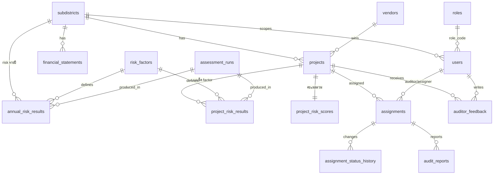

# Data Model Design — Local Budget Fraud Risk & Document Intelligence Assistant

**Target DB:** SQLite (prototype 1 เดือน ตาม Mission 3)
**Input:** `projects_ALL_master.csv` (98 โครงการ), `financial_report_ALL_master.csv` (337 แถว) — 3 ตำบล ปีงบ 2566–2568
**สถานะเอกสาร:** พร้อมให้ AI/dev นำไปสร้าง database และ seed ข้อมูลได้ทันที (DDL รันผ่าน SQLite แล้ว) — อัปเดต ก.ค. 2569: รวม annual factor Y1–Y3 (§5.1, §5.5, §11) จาก `Risk Factor Design ระดับงบรายปี.md`

---

## 0. หลักการออกแบบ

1. **แยก "ข้อเท็จจริง" ออกจาก "ผลวิเคราะห์"** — ตาราง input (projects, financial_statements) เก็บข้อมูลดิบตามต้นฉบับ ห้าม overwrite ด้วยผลคำนวณ ผล risk ทั้งหมดอยู่ในตารางฝั่ง risk engine (ตอบโจทย์ Responsible AI: แยกข้อมูลจริงจากข้อเสนอของ AI)
2. **Risk factor เป็น config ไม่ใช่ hard-code** — นิยาม factor, threshold, weight อยู่ในตาราง `risk_factors` แก้เกณฑ์ได้โดยไม่แก้ code และ Admin ตั้งค่าได้ตาม Feature 7
3. **ทุก risk score ต้องอธิบายได้** — ผลการเช็คแต่ละ factor เก็บเป็นรายแถวใน `*_risk_results` พร้อมค่าที่วัดได้ เกณฑ์ที่ใช้ และ evidence text → dashboard แสดง "ทำไมโครงการนี้เสี่ยง" ได้เสมอ
4. **รองรับ 2 ระดับการวิเคราะห์ตั้งแต่วันแรก** — ระดับโครงการ (factor A1–F1) และระดับงบรายปี/ตำบล (factor Y1–Y3 นิยามแล้ว ดู §11 และไฟล์ `Risk Factor Design ระดับงบรายปี.md`) ผ่านคอลัมน์ `scope` ใน `risk_factors` + ตารางผลแยกตาม grain

> **Scope รอบนี้:** โมดูล Document Intelligence + Chatbot + Legal Linkage และ document checklist **ถูกตัดออกก่อน** (จะเพิ่มใน phase ถัดไป — ดู §7) sentiment analysis ตัดออกเพราะการประเมินความกังวลอยู่ในแบบฟอร์มรายงานผลตรวจ (`audit_reports`) แล้ว

---

## 1. ERD ภาพรวม



ERD ฉบับเต็ม (มีคอลัมน์): ดูไฟล์ `data_model_erd.mermaid`

---

## 2. Conventions

| เรื่อง | กติกา |
|---|---|
| ชื่อตาราง/คอลัมน์ | อังกฤษ snake_case (ตรงกับ dictionary เดิมของฝั่ง projects) |
| ปีงบประมาณ | เก็บเป็น **พ.ศ.** (INTEGER เช่น 2567) ตามต้นฉบับ ทั้งสองไฟล์ใช้ พ.ศ. อยู่แล้ว |
| วันที่ | TEXT รูปแบบ ISO `YYYY-MM-DD` (ค.ศ.) — ต้องแปลงตอน seed (ดู §9) |
| เงิน | REAL หน่วยบาท |
| boolean | INTEGER 0/1 |
| JSON | เก็บใน TEXT (SQLite รองรับ `json_extract`) ใช้กับ threshold ของ factor และ evidence |
| เลขผู้เสียภาษี (TIN) | **TEXT เท่านั้น** — ห้าม numeric (ต้นฉบับโดน Excel แปลงเป็น 9.33543E+11 ไปแล้ว ดู §9.3) |
| FK | เปิด `PRAGMA foreign_keys = ON;` ทุก connection |
| Permission | SQLite ไม่มี row-level security → บังคับที่ app layer (ดู §12) |

---

## 3. โมดูล Master Data

### 3.1 `subdistricts` — ตำบล/เทศบาล

```sql
CREATE TABLE subdistricts (
    subdistrict_id   INTEGER PRIMARY KEY AUTOINCREMENT,
    name_th          TEXT NOT NULL UNIQUE,          -- ท่าช้าง / ปิงโค้ง / โยนก
    municipality_name TEXT,                          -- เทศบาลตำบลท่าช้าง (จากไฟล์งบการเงิน)
    district         TEXT,                           -- อำเภอ
    province         TEXT,
    data_completeness_note TEXT                      -- เช่น "ปิงโค้ง: ไม่มีวันที่/สัญญา/TIN — factor F1 คำนวณไม่ได้"
);
```

Seed: 3 แถว (ท่าช้าง/บางกล่ำ/สงขลา, ปิงโค้ง/เชียงดาว/เชียงใหม่, โยนก/เชียงแสน/เชียงราย — ยืนยันจากคอลัมน์ district/province ใน projects CSV)

### 3.2 `vendors` — ผู้รับจ้าง (แยกออกมาเพื่อวิเคราะห์ผู้ชนะซ้ำ)

```sql
CREATE TABLE vendors (
    vendor_id   INTEGER PRIMARY KEY AUTOINCREMENT,
    name        TEXT NOT NULL,
    tin         TEXT,                -- อาจถูกปกปิดบางส่วน (xxxx) หรือเสียจาก Excel
    tin_masked  INTEGER DEFAULT 0,   -- 1 = TIN ไม่สมบูรณ์ ใช้ name จับคู่แทน
    UNIQUE(name)
);
```

เหตุผล: ข้อมูลจริงมีผู้ชนะซ้ำสูง (ที เอ็น ดับเบิ้ลยูฯ ชนะ 12 โครงการ, พีเอพีฯ 10 โครงการ) → เป็นวัตถุดิบ risk factor กลุ่มผู้รับจ้างซ้ำในอนาคต dedup ด้วย `name` (TIN เชื่อไม่ได้ ดู §9.3)

### 3.3 `roles` + `users`

```sql
-- บทบาทผู้ใช้ (ที่มา: roles.md — source of truth; สิทธิ์/scope บังคับที่ app layer ดู §12)
CREATE TABLE roles (
    role_code       TEXT PRIMARY KEY,
    display_name_th TEXT NOT NULL,
    description     TEXT
);

CREATE TABLE users (
    user_id        INTEGER PRIMARY KEY AUTOINCREMENT,
    username       TEXT NOT NULL UNIQUE,
    password_hash  TEXT NOT NULL,               -- mock login ได้ตาม scope
    display_name   TEXT,
    role           TEXT NOT NULL REFERENCES roles(role_code),
    subdistrict_id INTEGER REFERENCES subdistricts(subdistrict_id),  -- NULL สำหรับ role ที่เห็นทุกตำบล
    created_at     TEXT DEFAULT (datetime('now'))
);
```

Role ทั้ง 6 (5 role จาก `roles.md` + `admin` สำหรับดูแลระบบ):

| role_code | ชื่อแสดงผล | ขอบเขตข้อมูล |
|---|---|---|
| `admin` | ผู้ดูแลระบบ | ทุกตำบล + ตั้งค่า risk_factors / app_config / users |
| `regional_supervisor` | ผู้บริหาร/ผู้กำกับดูแลระดับอำเภอ/จังหวัด | ทุกตำบล |
| `local_executive` | ผู้บริหาร (นายก อบต. / ปลัด) | เฉพาะตำบลของตนเอง |
| `project_auditor` | ผู้ตรวจสอบโครงการ | เฉพาะตำบลของตนเอง |
| `risk_analyst` | นักวิเคราะห์ข้อมูล / ทีมตรวจสอบภายใน | เฉพาะตำบลของตนเอง (งานตรวจกรองตาม assignment) |
| `public_user` | ประชาชนทั่วไป | ทุกตำบล แต่ไม่เห็นข้อมูลที่ถูกปิดไว้ และไม่มีสิทธิ์แก้ไข |

รายละเอียดสิทธิ์ (permission) ของแต่ละ role ดู `roles.md` — เก็บเฉพาะชื่อ/คำอธิบาย role ในตาราง `roles` ส่วนการบังคับสิทธิ์ทำที่ app layer (`require_roles(...)` ใน `src/auth.py`) ตาม §12

---

## 4. โมดูลข้อมูลนำเข้า (Input)

### 4.1 `projects` — จาก `projects_ALL_master.csv`

```sql
CREATE TABLE projects (
    project_id        TEXT PRIMARY KEY,             -- เลขที่ e-GP เช่น '65127236035'
    subdistrict_id    INTEGER NOT NULL REFERENCES subdistricts(subdistrict_id),
    budget_year       INTEGER NOT NULL,             -- พ.ศ.
    project_name      TEXT NOT NULL,
    project_type      TEXT,                         -- จ้างก่อสร้าง/ซื้อ/จ้างทำของฯ/เช่า
    dept_name         TEXT,
    dept_sub_name     TEXT,
    purchase_method   TEXT,
    purchase_method_group TEXT,
    announce_date     TEXT,                         -- ISO, NULL ได้ (ปิงโค้งไม่มี)
    transaction_date  TEXT,
    budget_amount     REAL,                         -- งบประมาณโครงการ
    reference_price   REAL,                         -- ราคากลาง
    contract_value    REAL,                         -- วงเงินสัญญา
    price_ratio       REAL,                         -- สัญญา/ราคากลาง (คำนวณใหม่ตอน seed ดู §9.4)
    project_status    TEXT,
    contract_no       TEXT,
    contract_date     TEXT,
    contract_finish_date TEXT,
    contract_duration_days INTEGER,
    contract_status   TEXT,
    vendor_id         INTEGER REFERENCES vendors(vendor_id),
    data_quality_note TEXT,                         -- เช่น "แถวต้นฉบับถูกตัดท้าย"
    source_file       TEXT
);
CREATE INDEX idx_projects_sub_year ON projects(subdistrict_id, budget_year);
CREATE INDEX idx_projects_vendor   ON projects(vendor_id);
```

### 4.2 `financial_statements` — จาก `financial_report_ALL_master.csv` (คง long/tidy format เดิม)

```sql
CREATE TABLE financial_statements (
    fs_id            INTEGER PRIMARY KEY AUTOINCREMENT,
    subdistrict_id   INTEGER NOT NULL REFERENCES subdistricts(subdistrict_id),
    fiscal_year      INTEGER NOT NULL,              -- พ.ศ.
    statement_type   TEXT NOT NULL,                 -- งบแสดงฐานะการเงิน / งบแสดงผลการดำเนินงาน / งบประมาณตามหมวด / สินทรัพย์ถาวรเพิ่มระหว่างปี / ตัวชี้วัดความเสี่ยง
    category         TEXT,                          -- หมวดหมู่ เช่น สินทรัพย์หมุนเวียน, รายได้
    account_item     TEXT NOT NULL,                 -- รายการบัญชี
    note_no          TEXT,                          -- เลขหมายเหตุประกอบงบ
    value            REAL,
    unit             TEXT,                          -- บาท / ร้อยละ / เท่า
    detail_level     TEXT CHECK (detail_level IN ('line_item','subtotal','total','indicator','reference')),
    data_quality_note TEXT,
    source_file      TEXT,
    UNIQUE(subdistrict_id, fiscal_year, statement_type, category, account_item)
);
CREATE INDEX idx_fs_sub_year_type ON financial_statements(subdistrict_id, fiscal_year, statement_type);
```

เหตุผลที่คง long format: ตรง dictionary เดิม, เพิ่มปี/ตำบล/ประเภทงบใหม่ได้โดยไม่แก้ schema, และ annual risk factor ในอนาคตคำนวณจาก query ตรงๆ ได้ (เช่น YoY ของ `detail_level='total'`)
**ข้อระวังที่ต้อง encode ลง app logic:** ห้ามรวมยอดข้ามแถวที่ `unit ≠ 'บาท'` และห้ามรวม `subtotal/total` กับ `line_item` ซ้ำซ้อน; ปิงโค้งมีเฉพาะ subtotal → เทียบข้ามตำบลได้เฉพาะระดับ subtotal/total

---

## 5. โมดูล Risk Engine (หัวใจของระบบ)

### 5.1 `risk_factors` — นิยาม factor แบบ config-driven

```sql
CREATE TABLE risk_factors (
    factor_code   TEXT PRIMARY KEY,                 -- project: 'A1','A2','A3','D1','F1' / annual: 'Y1','Y2','Y3'
    scope         TEXT NOT NULL CHECK (scope IN ('project','annual')),
    name_th       TEXT NOT NULL,
    description   TEXT NOT NULL,                    -- นิยาม + เหตุผลว่าเป็นสัญญาณเสี่ยงอย่างไร
    formula       TEXT NOT NULL,                    -- สูตร/เงื่อนไขเชิงคำนวณ อ่านได้ทั้งคนและ AI
    params_json   TEXT NOT NULL DEFAULT '{}',       -- threshold + likelihood_map (โอกาส 1–5) เช่น {"discount_pct_min":0.15,"likelihood_map":[...]}
    weight        REAL NOT NULL DEFAULT 1.0,        -- น้ำหนักตอนรวมคะแนนสัดส่วน
    severity      TEXT NOT NULL DEFAULT 'medium' CHECK (severity IN ('low','medium','high')),
    impact_level  INTEGER NOT NULL DEFAULT 3 CHECK (impact_level BETWEEN 1 AND 5),  -- ผลกระทบคงที่ต่อ factor (5×5 matrix)
    legal_ref     TEXT,                             -- ฐานกฎหมาย/ระเบียบอ้างอิง (⚠️ ให้ฝ่ายกฎหมายยืนยันเลขมาตรา/ข้อ)
    data_requirement TEXT,                          -- คอลัมน์ที่ต้องมี → บอกได้ว่าตำบลไหนคำนวณไม่ได้
    enabled       INTEGER NOT NULL DEFAULT 1,
    created_at    TEXT DEFAULT (datetime('now'))
);
```

> **อัปเดต ก.ค. 2569 — กรอบ 5×5 (โอกาส × ผลกระทบ):** เพิ่ม `impact_level` (ผลกระทบคงที่ 1–5) และ
> `legal_ref` ต่อ factor; `params_json` เพิ่ม `likelihood_map` (map ค่าที่วัดได้ → โอกาส 1–5)
> รายละเอียดวิธีคิด/เกณฑ์ ดู **`docs/RISK_ASSESSMENT_METHODOLOGY.md`** (source of truth ของวิธีประเมิน)

**Seed 5 factor ระดับโครงการ (จาก Risk Factor Design ระดับโครงการ.pdf):**

| code | scope | นิยาม | params_json (ค่าเริ่มต้น) | คำนวณได้จากข้อมูลปัจจุบัน? |
|---|---|---|---|---|
| A1 | project | ส่วนลดผิดปกติ: (ราคากลาง−ราคาสัญญา)/ราคากลาง > 15% | `{"discount_pct_min":0.15}` | ✅ ทุกตำบล (price_ratio) |
| A2 | project | ส่วนลดน้อยผิดปกติ: ชนะที่ 99–100% ของราคากลาง | `{"ratio_min":0.99,"ratio_max":1.00}` | ✅ ทุกตำบล |
| A3 | project | ราคากลางชนงบพอดี: \|ราคากลาง−งบ\|/งบ < 0.5% ซ้ำๆ ในหน่วยงานเดียว | `{"gap_pct_max":0.005,"min_occurrences":2}` | ⚠️ เฉพาะแถวที่มี dept_name (ปิงโค้งไม่มี → เช็คระดับตำบลแทน) |
| D1 | project | วงเงินหวุดหวิดใต้เกณฑ์เฉพาะเจาะจง 450,000–499,999 | `{"band_low":450000,"band_high":499999}` | ✅ ทุกตำบล |
| F1 | project | โครงการกระจุกตัวเดือนสิ้นปีงบ (ส.ค.–ก.ย.) | `{"months":[8,9]}` | ⚠️ เฉพาะท่าช้าง/โยนก (ปิงโค้งไม่มีวันที่) |

**Seed 3 factor ระดับงบรายปี (จาก Risk Factor Design ระดับงบรายปี.md):**

| code | scope | นิยาม | severity | เกณฑ์ (ต่อเนื่อง — ดู §11.2) | คำนวณได้จากข้อมูลปัจจุบัน? |
|---|---|---|---|---|---|
| Y1 | annual | อัตราการพึ่งพาตนเองทางการคลัง = (รายได้จัดเก็บเอง + รายได้รัฐจัดเก็บให้) / (รายได้รวม − เงินกู้) × 100 | medium | ≥55% low, 30–55% medium, <30% high | ✅ ทั้ง 3 ตำบล ทุกปีที่มีงบ (เงินกู้ไม่มีในข้อมูล → ถือเป็น 0) |
| Y2 | annual | ดุลการดำเนินงานประจำปี = (รายได้ − ค่าใช้จ่าย) / รายได้รวม × 100 | high | ≥15% low, 0–15% medium, <0% high | ✅ ทั้ง 3 ตำบล (ใช้แถวสรุปผลจากงบผลการดำเนินงาน) |
| Y3 | annual | Cash Coverage = เงินสดและรายการเทียบเท่า / (ภาระผูกพัน + หนี้สินหมุนเวียน) | high | ≥5 เท่า low, 1–5 เท่า medium, <1 เท่า high | ✅ ทั้ง 3 ตำบล (ภาระผูกพันงบดุลไม่มีในข้อมูล → ถือเป็น 0) |

params_json ของ Y1–Y3 เก็บ 2 ส่วน: (1) threshold ต่อเนื่อง (2) **account_map** — รายชื่อ `account_item` จริงในตาราง `financial_statements` ที่ map เข้าแต่ละตัวแปรของสูตร (ชื่อรายการบัญชีต่างกันต่อตำบล) — รายละเอียดเต็มดู §11

### 5.2 `assessment_runs` — audit trail ของการคำนวณ

```sql
CREATE TABLE assessment_runs (
    run_id       INTEGER PRIMARY KEY AUTOINCREMENT,
    run_at       TEXT NOT NULL DEFAULT (datetime('now')),
    triggered_by TEXT,                              -- 'system' หรือ user_id
    factor_config_snapshot TEXT,                    -- JSON snapshot ของ risk_factors ณ ตอนรัน (reproducibility)
    note         TEXT
);
```

### 5.3 `project_risk_results` — ผลเช็คราย factor รายโครงการ (evidence layer)

```sql
CREATE TABLE project_risk_results (
    result_id     INTEGER PRIMARY KEY AUTOINCREMENT,
    run_id        INTEGER NOT NULL REFERENCES assessment_runs(run_id),
    project_id    TEXT NOT NULL REFERENCES projects(project_id),
    factor_code   TEXT NOT NULL REFERENCES risk_factors(factor_code),
    triggered     INTEGER NOT NULL CHECK (triggered IN (0,1)),
    computable    INTEGER NOT NULL DEFAULT 1,       -- 0 = ข้อมูลไม่พอ (เช่น F1 กับปิงโค้ง) ≠ ไม่เสี่ยง
    observed_value REAL,                            -- ค่าที่วัดได้จริง เช่น discount 0.205
    threshold_used TEXT,                            -- JSON ของ params ที่ใช้ ณ ตอนรัน
    evidence_text TEXT,                             -- คำอธิบายภาษาคน เช่น "ส่วนลด 20.5% เกินเกณฑ์ 15%"
    likelihood    INTEGER,                          -- โอกาส 1–5 (NULL เมื่อ computable=0)
    impact        INTEGER,                          -- ผลกระทบ 1–5 (สำเนาจาก risk_factors.impact_level ณ ตอนรัน)
    matrix_score  INTEGER,                          -- likelihood × impact (1–25)
    risk_band     TEXT CHECK (risk_band IN ('ต่ำ','ปานกลาง','สูง','สูงมาก')),  -- ระดับตาม 5×5 matrix
    UNIQUE(run_id, project_id, factor_code)
);
CREATE INDEX idx_prr_project ON project_risk_results(project_id, run_id);
```

`computable=0` สำคัญมาก: ตอบโจทย์ Responsible AI "ระบุกรณีที่ข้อมูลไม่เพียงพอ" — UI ต้องแสดง "ประเมินไม่ได้" ไม่ใช่ "ผ่าน"

### 5.4 `project_risk_scores` — คะแนนรวมต่อโครงการต่อ run

```sql
CREATE TABLE project_risk_scores (
    score_id    INTEGER PRIMARY KEY AUTOINCREMENT,
    run_id      INTEGER NOT NULL REFERENCES assessment_runs(run_id),
    project_id  TEXT NOT NULL REFERENCES projects(project_id),
    risk_score  REAL NOT NULL,                      -- 0–100 (คะแนนสัดส่วน — จัดอันดับละเอียด)
    risk_level  TEXT NOT NULL CHECK (risk_level IN ('low','medium','high')),
    matrix_likelihood INTEGER,                      -- โอกาสรวมของโครงการ 1–5 (โอกาสสูงสุด + โบนัส corroboration)
    matrix_impact     INTEGER,                      -- ผลกระทบสูงสุดของ factor ที่ triggered 1–5
    matrix_score      INTEGER,                      -- matrix_likelihood × matrix_impact (1–25)
    matrix_level TEXT CHECK (matrix_level IN ('ต่ำ','ปานกลาง','สูง','สูงมาก')),  -- headline 5×5
    factors_triggered INTEGER NOT NULL,
    factors_not_computable INTEGER NOT NULL DEFAULT 0,
    summary_text TEXT,                              -- "งบเพิ่มสูง, เอกสารไม่ครบ" (สำหรับ dashboard Feature 2)
    UNIQUE(run_id, project_id)
);
```

> **5×5 (§ methodology ข้อ 5):** headline โครงการใช้ `matrix_level` — ยึด risk item รุนแรงสุด
> แล้ว +1 โอกาสเมื่อมีสัญญาณยืนยันกัน ≥3 ตัว; `risk_score/risk_level` เดิมคงไว้จัดอันดับละเอียด

สูตรรวมคะแนน (ให้ engine ฝั่ง app implement): `risk_score = 100 × Σ(weight ของ factor ที่ triggered) / Σ(weight ของ factor ที่ computable)` แล้ว map เป็น level ด้วยเกณฑ์ใน `app_config` (default: <30 low, 30–60 medium, >60 high) — ปรับได้โดย admin

### 5.5 `annual_risk_results` — ผลเช็ค factor ระดับงบรายปี/ตำบล (factor Y1–Y3)

```sql
CREATE TABLE annual_risk_results (
    result_id     INTEGER PRIMARY KEY AUTOINCREMENT,
    run_id        INTEGER NOT NULL REFERENCES assessment_runs(run_id),
    subdistrict_id INTEGER NOT NULL REFERENCES subdistricts(subdistrict_id),
    fiscal_year   INTEGER NOT NULL,
    factor_code   TEXT NOT NULL REFERENCES risk_factors(factor_code),
    triggered     INTEGER NOT NULL CHECK (triggered IN (0,1)),
    computable    INTEGER NOT NULL DEFAULT 1,
    risk_level    TEXT CHECK (risk_level IN ('low','medium','high')),  -- NULL เมื่อ computable=0
    observed_value REAL,
    threshold_used TEXT,
    evidence_text TEXT,
    likelihood    INTEGER,                          -- โอกาส 1–5 (NULL เมื่อ computable=0)
    impact        INTEGER,                          -- ผลกระทบ 1–5 (จาก risk_factors.impact_level)
    matrix_score  INTEGER,                          -- likelihood × impact (1–25)
    risk_band     TEXT CHECK (risk_band IN ('ต่ำ','ปานกลาง','สูง','สูงมาก')),  -- ระดับตาม 5×5 matrix
    UNIQUE(run_id, subdistrict_id, fiscal_year, factor_code)
);
```

Grain = (ตำบล × ปีงบ × factor) — ตรงกับ grain ของไฟล์งบการเงิน รองรับคำถาม Mission "ตำบลใดมีแนวโน้มความเสี่ยงสูงขึ้นหรือลดลง"

**ต่างจาก `project_risk_results`:** factor รายปี (Y1–Y3) ให้ผลเป็น 3 ระดับ ไม่ใช่ binary → เพิ่มคอลัมน์ `risk_level` โดยกติกาคือ `triggered = 1 เมื่อ risk_level IN ('medium','high')` และ `risk_level = NULL เมื่อ computable = 0` (UI ต้องแสดง "ประเมินไม่ได้" เช่นเดิม)

### 5.6 `app_config` — เกณฑ์ระบบที่ admin ปรับได้

```sql
CREATE TABLE app_config (
    key   TEXT PRIMARY KEY,                          -- 'risk_level_medium_min', 'risk_level_high_min'
    value TEXT NOT NULL,
    description TEXT
);
```

---

## 6. โมดูล Audit Workflow (จากสรุป Flow การตรวจสอบ)

### 6.1 `assignments` — ผู้ตรวจสอบโครงการมอบหมายงานให้นักวิเคราะห์ (ขั้นที่ 2)

```sql
CREATE TABLE assignments (
    assignment_id INTEGER PRIMARY KEY AUTOINCREMENT,
    project_id    TEXT NOT NULL REFERENCES projects(project_id),
    assigned_to   INTEGER NOT NULL REFERENCES users(user_id),   -- risk_analyst (นักวิเคราะห์)
    assigned_by   INTEGER NOT NULL REFERENCES users(user_id),   -- project_auditor (ผู้ตรวจสอบโครงการ)
    priority      TEXT NOT NULL DEFAULT 'normal' CHECK (priority IN ('low','normal','high')),
    note          TEXT NOT NULL DEFAULT '',
    due_date      TEXT,
    budget_hours  REAL,
    audit_steps   TEXT NOT NULL DEFAULT '',
    status        TEXT NOT NULL DEFAULT 'waiting_acceptance' CHECK (status IN (
        'waiting_acceptance','accepted','in_progress','clarification_needed',
        'ready_for_review','under_review','revision_requested','completed'
    )),
    created_at    TEXT NOT NULL DEFAULT (datetime('now')),
    updated_at    TEXT NOT NULL DEFAULT (datetime('now'))
);
CREATE INDEX idx_assignments_assignee_status ON assignments(assigned_to, status);
```

### 6.2 `assignment_status_history` — ประวัติการเปลี่ยนสถานะงาน

```sql
CREATE TABLE assignment_status_history (
    history_id    INTEGER PRIMARY KEY AUTOINCREMENT,
    assignment_id INTEGER NOT NULL REFERENCES assignments(assignment_id),
    old_status    TEXT,
    new_status    TEXT NOT NULL,
    changed_by    INTEGER NOT NULL REFERENCES users(user_id),
    note          TEXT,
    created_at    TEXT NOT NULL DEFAULT (datetime('now'))
);
```

### 6.3 `audit_reports` — แบบฟอร์มรายงานผลตรวจ (ขั้นที่ 3 ตรงตามฟอร์มใน flow md)

```sql
CREATE TABLE audit_reports (
    report_id     INTEGER PRIMARY KEY AUTOINCREMENT,
    assignment_id INTEGER NOT NULL REFERENCES assignments(assignment_id),
    work_process  TEXT,                              -- กระบวนงาน/ภารกิจงาน
    objective     TEXT,                              -- วัตถุประสงค์ของกระบวนงาน
    likelihood    INTEGER CHECK (likelihood BETWEEN 1 AND 5),   -- โอกาส
    impact        INTEGER CHECK (impact BETWEEN 1 AND 5),       -- ผลกระทบ
    impact_score  INTEGER CHECK (impact_score BETWEEN 1 AND 5), -- ระดับคะแนนจากผลกระทบ
    risk_level    INTEGER CHECK (risk_level BETWEEN 1 AND 5),   -- ระดับความเสี่ยงโดยรวม
    findings      TEXT,
    submitted_at  TEXT DEFAULT (datetime('now'))
);
```

### 6.3 `auditor_feedback` — ความเห็น/ข้อสังเกตอิสระของผู้ตรวจต่อโครงการ

```sql
CREATE TABLE auditor_feedback (
    feedback_id   INTEGER PRIMARY KEY AUTOINCREMENT,
    project_id    TEXT NOT NULL REFERENCES projects(project_id),
    user_id       INTEGER NOT NULL REFERENCES users(user_id),
    comment       TEXT NOT NULL,
    manual_risk_score INTEGER CHECK (manual_risk_score BETWEEN 1 AND 5),  -- คะแนนที่ผู้ตรวจให้เอง
    created_at    TEXT DEFAULT (datetime('now'))
);
```

**หมายเหตุ:** ตัด sentiment analysis (AI) ออกจาก scope รอบนี้ — การประเมินระดับความเสี่ยง/ความกังวลใช้ likelihood/impact/risk_level ในแบบฟอร์ม `audit_reports` (§6.2) เป็นหลัก ถ้าจะเพิ่ม sentiment ภายหลัง ให้เพิ่มคอลัมน์ `sentiment_label`, `ai_summary` ในตารางนี้ (แยกจาก comment ของคนชัดเจนตามหลัก Responsible AI)

### 6.4 `access_log` — บันทึกการเข้าถึงของผู้ใช้ (accountability trail)

บันทึกว่า "ใครเข้าดู/ทำอะไรกับ resource ไหน เมื่อไหร่" เพื่อความรับผิดชอบตรวจสอบได้ตามมาตรฐานราชการ (แยกจาก audit trail ของ *ปัจจัยความเสี่ยง* — อันนั้นคือที่มาของคะแนน, อันนี้คือพฤติกรรมผู้ใช้)

```sql
CREATE TABLE access_log (
    log_id        INTEGER PRIMARY KEY AUTOINCREMENT,
    username      TEXT,                 -- denormalize: snapshot ณ เวลา action (ไม่ FK เผื่อ user ถูกลบ)
    role          TEXT,                 -- role ณ เวลา action
    action        TEXT NOT NULL,        -- login / view_list / view_detail / export / write / other
    method        TEXT NOT NULL,
    path          TEXT NOT NULL,
    resource_type TEXT,                 -- project / risk / subdistrict / financial / audit
    resource_id   TEXT,
    status_code   INTEGER,              -- เก็บทั้งสำเร็จ + 403/401 (ตรวจความพยายามเข้าถึงที่ไม่มีสิทธิ์)
    ip            TEXT,
    user_agent    TEXT,
    created_at    TEXT NOT NULL DEFAULT (datetime('now'))
);
CREATE INDEX idx_access_log_user_time ON access_log(username, created_at);
CREATE INDEX idx_access_log_time      ON access_log(created_at);
```

**การเขียน:** middleware ใน `src/main.py` เรียก `src/audit_log.py::record_access(...)` หลัง response เสร็จ — เขียนเฉพาะ request ที่มี header `X-Username` และไม่ใช่ noise (`/health`, `/docs`, preflight) เป็น **best-effort** (ถ้า filesystem อ่านอย่างเดียวบน serverless จะข้ามเงียบ ๆ ไม่ทำให้ request พัง). **อ่าน:** `GET /audit/access-log` (admin เท่านั้น) รองรับ filter `username/action/resource_type/date_from/date_to` + paging. เริ่ม **ว่างเปล่า** ใน seed; append-only (ไม่มี UPDATE/DELETE เพื่อกันลบร่องรอย).

> ⚠️ **ข้อจำกัดบน Vercel:** filesystem อ่านอย่างเดียวตอน runtime → log จะไม่ถูกเขียน (ดูว่างเปล่า). ฟีเจอร์นี้ทำงานเต็มรูปแบบเมื่อ deploy บนเซิร์ฟเวอร์ที่ DB เขียนได้ (สภาพแวดล้อมจริงของหน่วยงานที่ self-host). ระยะยาว: ย้าย log ไป DB ภายนอก/managed เพื่อความคงทน.

---

## 7. โมดูล Document Intelligence + Chatbot + Legal Linkage — **ตัดออกจาก scope รอบนี้**

ตัดสินใจ (ก.ค. 2569): ยังไม่ทำในรอบนี้ ได้แก่ ตารางเอกสาร/document chunks (RAG), checklist เอกสารประกอบ, ตารางกฎหมาย/ระเบียบ + การเชื่อม factor↔กฎหมาย, และตาราง chat ทั้งหมด

การออกแบบปัจจุบัน **ไม่ปิดทาง** การเพิ่มภายหลัง: ตารางกลุ่มนี้เป็น additive ล้วน (มีแต่ FK ชี้เข้าหา `projects`/`risk_factors`/`users` ที่มีอยู่แล้ว) → เพิ่มได้โดยไม่แตะ schema เดิม เมื่อถึง phase นั้นให้ยึดหลัก: chatbot ต้องเก็บ reference ต่อคำตอบ, เอกสารต้องแยก source primary/external ตามข้อบังคับ Mission §6.1

---

## 8. Views สำหรับ Dashboard (map ตรงกับ Required Features)

```sql
-- Feature 1: ภาพรวมรายตำบล
CREATE VIEW v_subdistrict_dashboard AS
SELECT s.name_th AS subdistrict, p.budget_year,
       COUNT(*)                              AS project_count,
       SUM(p.budget_amount)                  AS total_budget,
       SUM(CASE WHEN prs.risk_level='high' THEN 1 ELSE 0 END) AS high_risk_count,
       AVG(prs.risk_score)                   AS avg_risk_score
FROM projects p
JOIN subdistricts s ON s.subdistrict_id = p.subdistrict_id
LEFT JOIN project_risk_scores prs ON prs.project_id = p.project_id
   AND prs.run_id = (SELECT MAX(run_id) FROM assessment_runs)
GROUP BY s.name_th, p.budget_year;

-- Feature 2: รายละเอียดความเสี่ยงรายโครงการ + เหตุผล
CREATE VIEW v_project_risk_detail AS
SELECT p.project_id, p.project_name, s.name_th AS subdistrict, p.budget_year,
       prs.risk_score, prs.risk_level, prs.summary_text,
       prr.factor_code, rf.name_th AS factor_name,
       prr.triggered, prr.computable, prr.observed_value, prr.evidence_text
FROM projects p
JOIN subdistricts s ON s.subdistrict_id = p.subdistrict_id
LEFT JOIN project_risk_scores prs ON prs.project_id = p.project_id
   AND prs.run_id = (SELECT MAX(run_id) FROM assessment_runs)
LEFT JOIN project_risk_results prr ON prr.project_id = p.project_id AND prr.run_id = prs.run_id
LEFT JOIN risk_factors rf ON rf.factor_code = prr.factor_code;

-- Feature 3: แนวโน้มงบรายปี (จากงบการเงิน ระดับ total เท่านั้น เพื่อเทียบข้ามตำบลได้)
CREATE VIEW v_budget_trend AS
SELECT s.name_th AS subdistrict, f.fiscal_year, f.statement_type, f.category,
       f.account_item, f.value, f.unit
FROM financial_statements f
JOIN subdistricts s ON s.subdistrict_id = f.subdistrict_id
WHERE f.detail_level IN ('subtotal','total') AND f.unit = 'บาท';

-- Feature 1+3: ความเสี่ยงระดับงบรายปี Y1–Y3 ต่อตำบลต่อปี (run ล่าสุด) — สำหรับทีม web
CREATE VIEW v_annual_risk AS
SELECT s.name_th AS subdistrict, ar.fiscal_year,
       ar.factor_code, rf.name_th AS factor_name, rf.severity,
       ar.risk_level, ar.triggered, ar.computable,
       ar.observed_value, ar.evidence_text
FROM annual_risk_results ar
JOIN subdistricts s ON s.subdistrict_id = ar.subdistrict_id
JOIN risk_factors rf ON rf.factor_code = ar.factor_code
WHERE ar.run_id = (SELECT MAX(run_id) FROM assessment_runs);
```

---

## 9. CSV → Table Mapping + Transformation Rules (สำหรับ seed script)

### 9.1 ลำดับ seed

`subdistricts` → `vendors` → `projects` → `financial_statements` → `risk_factors` (A1–F1 + Y1–Y3) → `users` (mock) → รัน risk engine ครั้งแรก (`assessment_runs` → `project_risk_results` → `project_risk_scores` → `annual_risk_results`)

### 9.2 การอ่านไฟล์ (สำคัญ — เจอจริงจากการตรวจไฟล์)

| ปัญหา | วิธีจัดการ |
|---|---|
| BOM ที่หัวไฟล์ทั้งสองไฟล์ | เปิดด้วย `encoding='utf-8-sig'` |
| **NUL byte (\x00) ใน projects_ALL_master.csv** | อ่านทั้งไฟล์แล้ว `.replace('\x00','')` ก่อนส่งเข้า csv parser (csv.reader ปกติจะ crash) |
| ค่าว่าง | แปลงเป็น NULL — **ห้ามแปลงเป็น 0** (ปิงโค้งว่างเพราะไม่มีข้อมูล ไม่ใช่ศูนย์) |
| **แถวซ้ำใน projects_ALL_master.csv** | โยนก `67119096755` ปรากฏ 2 ครั้ง (ข้อมูลเหมือนกันทุกคอลัมน์) → dedup ด้วย project_id ตอน seed (`INSERT OR IGNORE`) และ log ไว้ → **จำนวนโครงการจริง = 97 ไม่ใช่ 98** |

### 9.3 mapping `projects_ALL_master.csv` → `projects` + `vendors`

| CSV | ตาราง.คอลัมน์ | Transform |
|---|---|---|
| subdistrict | projects.subdistrict_id | lookup จาก subdistricts.name_th |
| budget_year | budget_year | int (พ.ศ. คงเดิม) |
| project_id | project_id | TEXT ตามต้นฉบับ |
| announce_date, transaction_date, contract_date, contract_finish_date | คอลัมน์เดียวกัน | **ไฟล์ master ใช้ format `D/M/YYYY` ค.ศ.** (เช่น 10/1/2023) → parse `%d/%m/%Y` → ISO; "-" หรือว่าง → NULL |
| budget_amount, reference_price, contract_value | คอลัมน์เดียวกัน | float; แถว 0 ทั้งคู่ (ปิงโค้ง 68039298502) คงไว้ + ใส่ data_quality_note |
| price_ratio | price_ratio | **คำนวณใหม่** = contract_value/reference_price ปัดเศษ 4 ตำแหน่ง; NULL ถ้าตัวใดเป็น 0/NULL |
| winner_name, winner_tin | vendors | dedup ด้วย name; **TIN ในไฟล์ master เสียแล้ว (scientific notation `9.33543E+11`)** → เก็บเป็น TEXT + ตั้ง tin_masked=1; ถ้าต้องการ TIN จริงให้ดึงจากไฟล์ standard รายตำบลในโฟลเดอร์ย่อยแทน |
| (ไม่มีใน CSV) | data_quality_note | เติมจากเงื่อนไข: ปิงโค้งทุกแถว = "ข้อมูลสรุป ไม่มีวันที่/สัญญา/TIN"; 2 แถวต้นฉบับถูกตัดท้าย (ตาม dictionary) |

### 9.4 mapping `financial_report_ALL_master.csv` → `financial_statements`

| CSV (ไทย) | คอลัมน์ |
|---|---|
| ตำบล | subdistrict_id (lookup) |
| เทศบาล | → ใช้เติม subdistricts.municipality_name (ไม่เก็บซ้ำรายแถว) |
| ปีงบประมาณ | fiscal_year |
| ประเภทงบ | statement_type |
| หมวดหมู่ | category |
| รายการบัญชี | account_item |
| หมายเหตุ | note_no (TEXT) |
| มูลค่า | value (float) |
| หน่วย | unit |
| ระดับรายละเอียด | detail_level |
| หมายเหตุคุณภาพข้อมูล | data_quality_note |
| ไฟล์ต้นฉบับ | source_file |

### 9.5 Validation queries หลัง seed (ต้องผ่านทั้งหมด)

```sql
-- 1) จำนวนแถวตรงต้นฉบับ (98 แถว − 1 แถวซ้ำ = 97 โครงการ)
SELECT (SELECT COUNT(*) FROM projects) = 97 AND (SELECT COUNT(*) FROM financial_statements) = 337;
-- 2) ทุกโครงการ map ตำบลได้
SELECT COUNT(*) = 0 FROM projects WHERE subdistrict_id IS NULL;
-- 3) สมการบัญชี: สินทรัพย์รวม = หนี้สิน+ทุน ต่อตำบลต่อปี (เทียบแถว total)
-- 4) price_ratio สอดคล้อง: ABS(price_ratio - contract_value/reference_price) < 0.001 ทุกแถวที่ไม่ NULL
-- 5) ปีงบอยู่ในช่วง 2566–2568 ทั้งสองตาราง
```

---

## 10. ตัวอย่าง logic การเช็ค factor (pseudo-SQL ให้ AI implement)

```sql
-- A1: ส่วนลดผิดปกติ (>15%)
SELECT project_id, (reference_price - contract_value)/reference_price AS discount
FROM projects
WHERE reference_price > 0 AND contract_value > 0
  AND (reference_price - contract_value)/reference_price > 0.15;   -- จาก params_json

-- A2: ชนะ 99–100% ของราคากลาง
... WHERE price_ratio BETWEEN 0.99 AND 1.00;

-- A3: ราคากลางชนงบ (<0.5%) ซ้ำ ≥2 ครั้งใน dept เดียว (fallback: ตำบลเดียว ถ้า dept_name NULL)
-- D1: วิธีเฉพาะเจาะจง AND budget_amount BETWEEN 450000 AND 499999
-- F1: CAST(strftime('%m', transaction_date) AS INT) IN (8,9) — ข้ามแถวที่วันที่ NULL (computable=0)
```

ทุกโครงการต้องมีแถวผลครบทุก enabled factor (triggered 0/1 หรือ computable=0) — ห้าม "เงียบ"

---

## 11. Annual Risk Factors Y1–Y3 — สเปกการคำนวณ (สำหรับ seed + risk engine)

อ้างอิงนิยามจาก `Risk Factor Design ระดับงบรายปี.md` — ส่วนนี้แปลงนิยามให้ตรงกับ **ชื่อรายการบัญชีจริง** ใน `financial_statements` ซึ่งต่างกันต่อตำบล (ท่าช้าง/โยนกใช้ผังบัญชีมาตรฐาน อปท., ปิงโค้งใช้ชื่อสรุปของตัวเอง)

### 11.1 หลักการ account_map

แต่ละตัวแปรในสูตร (concept) map เข้ารายชื่อ `account_item` ที่เป็นไปได้ทั้งหมด (union ทุกตำบล) เก็บใน `params_json.account_map` — engine query ต่อ (ตำบล × ปี) แล้ว **บวกเฉพาะแถวที่เจอ** (`unit='บาท'`) จึงไม่ต้อง hardcode per ตำบล และ admin แก้ mapping ได้โดยไม่แก้ code (สอดคล้องหลักการ §0 ข้อ 2)

กติกากลาง:
* concept ที่ `items` ว่าง (loan, commitments — ไม่มีในข้อมูลปัจจุบัน) → ใช้ค่า 0 + ระบุใน evidence_text ว่า "ไม่มีข้อมูล ถือเป็น 0"
* concept หลักหาแถวไม่เจอเลย → `computable=0`, `risk_level=NULL`
* ตัวส่วน ≤ 0: Y1 → `computable=0`; Y3 → `risk_level='low'` + evidence "ไม่มีหนี้สินหมุนเวียน"
* ห้ามบวก line_item ปนกับ subtotal/total ใน concept เดียวกัน (กันนับซ้ำ — ข้อระวังเดิม §4.2)

### 11.2 เกณฑ์ต่อเนื่อง (ปิดช่องว่างจากเอกสารต้นฉบับ)

เอกสารต้นฉบับนิยามเกณฑ์แบบมีช่องว่าง (เช่น Y1 ไม่นิยามช่วง 30–40% และ 55–70%) → ปรับเป็น **2 จุดตัดต่อเนื่อง** เพื่อให้ทุกค่ามีระดับเสมอ:

| factor | low | medium | high |
|---|---|---|---|
| Y1 | ≥ 55% | 30% ≤ v < 55% | < 30% |
| Y2 | ≥ 15% | 0% ≤ v < 15% | < 0% (ขาดดุล) |
| Y3 | ≥ 5.0 เท่า | 1.0 ≤ v < 5.0 เท่า | < 1.0 เท่า |

`triggered = 1` เมื่อ risk_level เป็น medium หรือ high

### 11.3 Seed rows (INSERT ลง `risk_factors`)

**Y1 — อัตราการพึ่งพาตนเองทางการคลัง** (`severity='medium'`, `weight=1.0`)
สูตร: `(Σ own_and_shared_revenue) / (total_revenue − loan) × 100`

```json
{
  "low_min_pct": 55.0,
  "high_max_pct": 30.0,
  "account_map": {
    "own_and_shared_revenue": {
      "statement_type": "งบแสดงผลการดำเนินงาน",
      "items": [
        "รายได้จากการจัดเก็บภาษี ค่าธรรมเนียม ค่าปรับ และใบอนุญาต",
        "รายได้จากการขายสินค้าและบริการ",
        "รายได้ของกิจการเฉพาะการและหน่วยงานภายใต้สังกัด",
        "รายได้อื่น",
        "รายได้ภาษีจัดสรร",
        "ภาษี/ค่าธรรมเนียม/ค่าปรับท้องถิ่น",
        "ภาษีจัดสรร",
        "รายได้จากการขายและบริการ",
        "รายได้เฉพาะกิจกรรม"
      ]
    },
    "total_revenue": {
      "statement_type": "งบแสดงผลการดำเนินงาน",
      "items": ["รวมรายได้", "รายได้รวม (total_revenues)"]
    },
    "loan": { "items": [] }
  }
}
```

หมายเหตุ: รายการที่**ไม่นับ**เป็นรายได้จัดเก็บเอง/รัฐแบ่งให้ = เงินอุดหนุนทุกประเภท + รายได้จากงบประมาณ ("รายได้จากการอุดหนุนจากหน่วยงานภาครัฐ", "รายได้จากการอุดหนุนอื่นและบริจาค", "รายได้จากงบประมาณ", "เงินอุดหนุนจากรัฐบาล", "รายได้จากงบประมาณ (เริ่มปรากฏปี 2568)")

**Y2 — ดุลการดำเนินงานประจำปี** (`severity='high'`, `weight=1.0`)
สูตร: `operating_balance / total_revenue × 100` — ใช้แถวสรุปผลที่งบคำนวณไว้แล้ว (ข้อมูลจริงไม่แยกรายได้/รายจ่าย "ประจำ" ออกจากรายการลงทุน → ใช้ดุลรวมทั้งงบเป็น proxy ต้องระบุใน description)

```json
{
  "low_min_pct": 15.0,
  "high_max_pct": 0.0,
  "account_map": {
    "operating_balance": {
      "statement_type": "งบแสดงผลการดำเนินงาน",
      "items": [
        "รายได้สูง/(ต่ำ) กว่าค่าใช้จ่ายสุทธิ",
        "กำไร(ขาดทุน)สุทธิ = รายได้รวม - รายจ่ายรวม - ดอกเบี้ย"
      ]
    },
    "total_revenue": {
      "statement_type": "งบแสดงผลการดำเนินงาน",
      "items": ["รวมรายได้", "รายได้รวม (total_revenues)"]
    }
  }
}
```

**Y3 — Cash Coverage Ratio** (`severity='high'`, `weight=1.0`)
สูตร: `cash / (commitments + current_liabilities)`

```json
{
  "low_min_ratio": 5.0,
  "high_max_ratio": 1.0,
  "account_map": {
    "cash": {
      "statement_type": "งบแสดงฐานะการเงิน",
      "items": ["เงินสดและรายการเทียบเท่าเงินสด"]
    },
    "current_liabilities": {
      "statement_type": "งบแสดงฐานะการเงิน",
      "items": ["รวมหนี้สินหมุนเวียน", "หนี้สินหมุนเวียนรวม"]
    },
    "commitments": { "items": [] }
  }
}
```

### 11.4 Pseudo-logic ของ engine (ต่อ factor ต่อตำบลต่อปี)

```sql
-- ดึงค่า concept หนึ่งตัว (ตัวอย่าง: total_revenue ของ Y1/Y2)
SELECT SUM(value) FROM financial_statements
WHERE subdistrict_id = :sid AND fiscal_year = :fy
  AND statement_type = :stype AND unit = 'บาท'
  AND account_item IN (:items_from_account_map);
-- NULL (ไม่เจอแถว) → computable=0 ยกเว้น concept ที่ items ว่าง → 0
```

ข้อระวังปิงโค้ง: "รายได้รวม" มี 2 แถว total ("รายได้รวม (total_revenues)" กับ "รายได้รวม (ตามรายงานต้นฉบับ, ใช้ตรวจสอบ)") — account_map ระบุเฉพาะแถวแรก **ห้ามใช้ IN แบบ LIKE/prefix** มิฉะนั้นจะนับซ้ำ

จากนั้น: คำนวณ observed_value ตามสูตร → map เป็น risk_level ตาม §11.2 → เขียน `annual_risk_results` (เก็บ params ที่ใช้ลง threshold_used และคำอธิบายลง evidence_text เช่น "พึ่งพาตนเอง 42.3% อยู่ช่วง 30–55% = เสี่ยงปานกลาง") — ทุก (ตำบล × ปีที่มีงบ) ต้องมีแถวผลครบทุก factor ห้าม "เงียบ"

### 11.5 ความพร้อมของข้อมูล + การ validate

* ครบทั้ง 7 ชุด: ท่าช้าง 2567–2568, โยนก 2567–2568, ปิงโค้ง 2566–2568 — ตรวจแล้วทุกชุดมีแถวที่ Y1–Y3 ต้องใช้ครบ
* **Cross-check:** ปิงโค้งมี `ตัวชี้วัดความเสี่ยง` คำนวณไว้แล้วในไฟล์ (เช่น "พึ่งพาเงินอุดหนุนรัฐ/รายได้รวม", "กำไรสุทธิ/รายได้รวม (surplus margin)", "Current ratio") → ใช้เทียบผล engine หลังรันครั้งแรก (Y1 ควร ≈ 100 − พึ่งพาอุดหนุน, Y2 ≈ surplus margin)
* **Data anomaly ที่ต้องแจ้งทีม:** ปิงโค้ง 2568 "เงินอุดหนุนจากรัฐบาล" = 199,073.90 บาท (ปีก่อน ~41 ล้าน; indicator พึ่งพาอุดหนุนเหลือ 0.2%) → Y1 ปีนี้จะออก "เสี่ยงต่ำ" ผิดปกติ — อย่าแก้ข้อมูลดิบ (หลักการ §0 ข้อ 1) ให้บันทึกใน `data_quality_note` และแสดง caveat บน dashboard

---

## 12. Permission ที่ App Layer (SQLite ไม่มี row-level security)

Role และสิทธิ์นิยามใน `roles.md` (source of truth) — DB เก็บเฉพาะตาราง `roles` (ชื่อ + คำอธิบาย)
การบังคับสิทธิ์ทำที่ app layer: scope ตำบลผ่าน `scope_subdistrict_ids(...)` และสิทธิ์ราย endpoint
ผ่าน `require_roles(...)` ใน `src/auth.py` — ทุก query ต้องผ่าน filter กลางตาม role:

| Role | ขอบเขตข้อมูล | Filter บังคับ | สิทธิ์เด่น (ตาม roles.md) |
|---|---|---|---|
| admin | ทุกตำบล | ไม่ filter | ทุกสิทธิ์ + แก้ risk_factors, app_config, users |
| regional_supervisor | ทุกตำบล | ไม่ filter | ดู dashboard ทั้งหมด, ดูทุกโครงการ, กรองตามตำบล, ดูข้อมูลการตรวจสอบสาธารณะ |
| local_executive | เฉพาะตำบลตนเอง | `WHERE subdistrict_id = :user_subdistrict` | ดู dashboard + โครงการของตำบลตนเอง, ดูข้อมูลการตรวจสอบสาธารณะ |
| project_auditor | เฉพาะตำบลตนเอง | `WHERE subdistrict_id = :user_subdistrict` | มอบหมายงานตรวจสอบ (assignments), ดูรายงานของทีม, ใช้ chatbot |
| risk_analyst | เฉพาะตำบลตนเอง | ตำบลตนเอง + `/audit/assignments` กรอง `assigned_to = :user_id` | ดูโครงการที่ได้รับมอบหมาย, ส่งรายงานผลตรวจ (audit_reports), ใช้ chatbot |
| public_user | ทุกตำบล | ไม่ filter แต่ **ไม่เห็นข้อมูลที่ถูกปิดไว้** (เช่น /audit/*) — read-only | ดู dashboard, ดูโครงการ, กรองตามตำบล |

แนะนำ implement เป็น middleware/repository layer เดียว ห้าม query ตารางตรงจาก UI

---

## 13. Traceability: ตาราง ↔ Mission 3 Features

| Mission Feature | ตาราง/View ที่รองรับ |
|---|---|
| F1 Project Risk Dashboard | v_subdistrict_dashboard |
| F2 Risk Factor Analysis (อธิบายได้) | risk_factors, project_risk_results, project_risk_scores, v_project_risk_detail |
| F3 Time Series & Trend | financial_statements, v_budget_trend, projects(budget_year) |
| F4 Chatbot + references | — ตัดออกจาก scope รอบนี้ (§7) |
| F5 Legal linkage | — ตัดออกจาก scope รอบนี้ (§7) |
| F6 Feedback (sentiment ตัดออก — ใช้ risk assessment ในฟอร์มแทน) | auditor_feedback, audit_reports |
| F7 Role-based access | users, roles, §12 (นิยาม role ดู roles.md) |
| Responsible AI | computable flag, assessment_runs (audit trail), evidence_text ทุก factor |
| Risk factor รายปี Y1–Y3 | risk_factors(scope='annual'), annual_risk_results, v_annual_risk, §11 |

---

## 14. สิ่งที่ทีม Application ต้องทำต่อ (execution checklist)

1. รัน DDL ทั้งหมด (§3–§8) — ไฟล์นี้เรียงตามลำดับ dependency แล้ว
2. เขียน seed script ตาม §9 (Python + sqlite3, ระวัง NUL byte และ date format) รวม seed risk_factors ทั้ง A1–F1 (§5.1) และ Y1–Y3 (§11.3)
3. รัน validation §9.5
4. Implement risk engine ตาม §5 + §10 (project) และ §11 (annual) — config-driven อ่าน params_json
5. ตรวจผล Y1/Y2 ของปิงโค้งเทียบ indicator ที่คำนวณไว้แล้วในไฟล์ (§11.5)
6. Implement permission middleware ตาม §12
