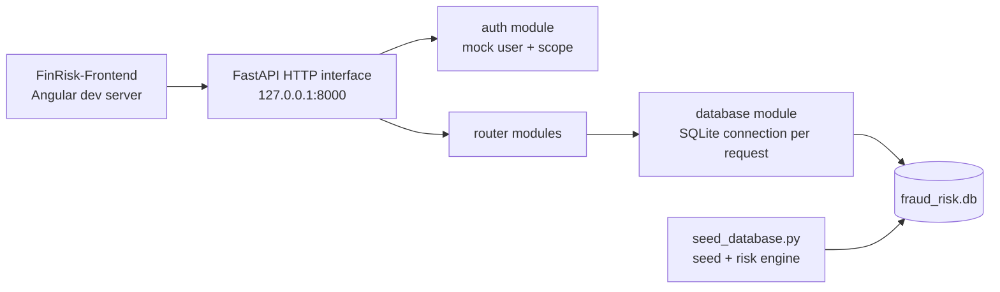
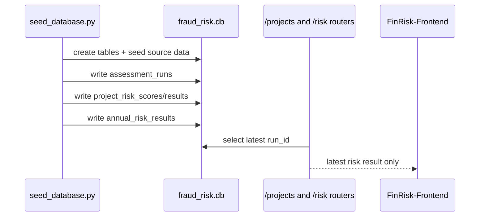

# FinRisk Backend Architecture

เอกสารนี้ล็อกสถาปัตยกรรมของ `FinRisk-Backend` หลังแยก frontend ไปอยู่ repo
`Chain361/FinRisk-Frontend` แล้ว

Backend repo นี้เป็นเจ้าของข้อมูล, role scope, risk engine result, และ HTTP interface
สำหรับ dashboard. Frontend repo เป็น client แยก และไม่ควร commit โค้ด Angular เข้ามาใน repo นี้

## Runtime Topology



## Repository Responsibility

| Repo | Owns | Does not own |
|---|---|---|
| `FinRisk-Backend` | SQLite schema/data, seed pipeline, risk results, auth/scope, HTTP interface | Angular pages, chart rendering, browser state |
| `FinRisk-Frontend` | Angular routes, UI modules, chart adapters, dashboard aggregation | risk score computation, role scope enforcement, raw database access |

## Backend Modules

```text
src/
├── main.py                  # FastAPI app, CORS, router registration, /health
├── config.py                # DB path, CORS origins, app metadata
├── database.py              # SQLite connection module
├── auth.py                  # mock auth and role/subdistrict scope
├── schemas.py               # Pydantic request/response shapes where needed
└── routers/
    ├── auth.py              # /auth/login, /auth/me
    ├── subdistricts.py      # /subdistricts
    ├── projects.py          # /projects, /projects/{project_id}
    ├── risk.py              # /risk/factors, /risk/annual, /risk/summary
    └── audit.py             # audit workflow skeleton
```

## HTTP Interface

The HTTP interface has no `/api` prefix. Frontend must call `http://127.0.0.1:8000/<resource>`.

| Resource | Purpose | Auth |
|---|---|---|
| `POST /auth/login` | mock login, returns `{ token, user }` | no |
| `GET /auth/me` | current mock user | `X-Username` |
| `GET /subdistricts` | allowed subdistrict dropdown | `X-Username` |
| `GET /projects` | project list with latest risk score | `X-Username` |
| `GET /projects/{project_id}` | project drill-down and factor evidence | `X-Username` |
| `GET /risk/factors` | risk factor catalog | `X-Username` |
| `GET /risk/annual` | annual risk result per factor/year/subdistrict | `X-Username` |
| `GET /risk/summary` | project count by risk level | `X-Username` |
| `GET /audit/*` | audit workflow skeleton | `X-Username` |

## Auth and Scope Interface

Auth is mock-only.

Interface:
- login body: `{ "username": "...", "password": "password123" }`
- returned token is the username
- authenticated requests must send `X-Username: <token>`

Scope invariant (role นิยามใน `roles.md` — seed ลงตาราง `roles`; สิทธิ์บังคับที่ app layer):
- `local_executive`, `project_auditor`, `risk_analyst` เห็นเฉพาะ `subdistrict_id` ของตัวเอง
- `admin`, `regional_supervisor`, `public_user` เห็นทุกตำบล
  (`public_user` เป็น read-only และไม่เห็นข้อมูลที่ถูกปิดไว้ เช่น `/audit/*`)
- router ที่คืนข้อมูลระดับตำบลต้องเรียก `scope_subdistrict_ids(conn, user)` เสมอ
- endpoint ที่จำกัดบทบาทใช้ `require_roles(...)` เช่น `/audit/assignments`

This scope check is a backend responsibility. Frontend filters are UX only.

## Database Module

`database.py` opens one SQLite connection per request.

Important implementation detail:

```python
sqlite3.connect(str(DB_PATH), check_same_thread=False)
```

FastAPI generator dependencies can enter and exit in different worker threads. This setting prevents
the request from failing with `sqlite3.ProgrammingError` when the connection is closed from a different
thread than the one that created it.

The module also sets:

```sql
PRAGMA foreign_keys = ON;
```

## Risk Result Lifecycle



Routers read from the latest `assessment_runs.run_id`. The current HTTP interface does not rerun the
risk engine. To refresh risk results, run `python seed_database.py` or add a dedicated rerun module later.

## CORS Contract

Default allowed dev origins:

```text
http://localhost:3000
http://127.0.0.1:3000
http://localhost:5173
http://127.0.0.1:5173
```

`localhost` and `127.0.0.1` are different browser origins. Keep both unless the frontend dev URL is fixed.

Override with:

```bash
CORS_ORIGINS=http://127.0.0.1:3000 uvicorn src.main:app --reload
```

## Data Completeness Policy

Risk result rows may be non-computable. Backend returns the source truth:

- `computable = 0` means not enough data
- `observed_value` may be null
- `triggered = 0` is not the same as `computable = 0`

Frontend must render non-computable values as `ประเมินไม่ได้` and must not coerce them to zero in charts.

## Adding a New HTTP Resource

1. Add the route in the matching `src/routers/*` module.
2. Require `get_current_user` unless the route is explicitly public.
3. Apply `scope_subdistrict_ids()` for any data tied to `subdistrict_id`.
4. Return dict/list shapes that can be serialized directly.
5. Add or update a smoke test if the route is used by frontend.
6. Update this architecture file and the frontend `core/api` interface together.

## Future Architecture Work

- Replace mock auth with a production auth implementation behind the same auth seam.
- Add a `/financials` resource only if stakeholders require raw revenue/expense/cash time series.
- Add a rerun risk-engine module instead of requiring `seed_database.py` for refreshes.
- Move audit workflow from skeleton routes to implemented assignment/report modules.
