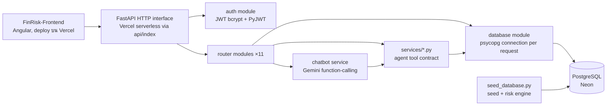
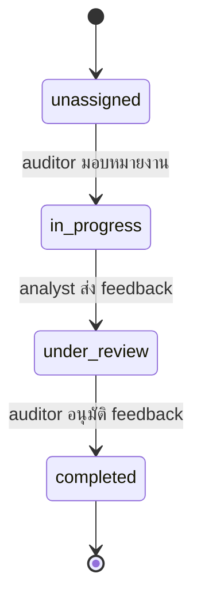
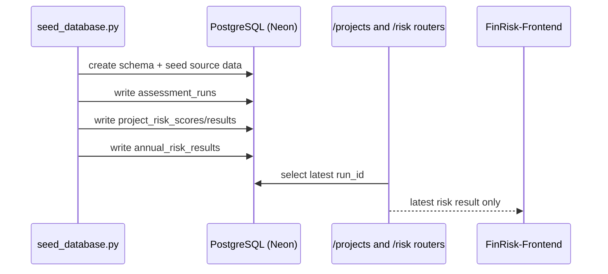

# FinRisk Backend Architecture

เอกสารนี้ล็อกสถาปัตยกรรมของ `FinRisk-Backend` หลังแยก frontend ไปอยู่ repo
`Chain361/FinRisk-Frontend` แล้ว

Backend repo นี้เป็นเจ้าของข้อมูล, role scope, risk engine result, และ HTTP interface
สำหรับ dashboard. Frontend repo เป็น client แยก และไม่ควร commit โค้ด Angular เข้ามาใน repo นี้

> เอกสารนี้ครอบคลุมภาพรวมสถาปัตยกรรม — รายละเอียด chatbot orchestration (โมเดล, tool-calling,
> ทำไมไม่ใช้ RAG) แยกไว้ที่ `docs/chatbot_architecture.md`

## Runtime Topology


```mermaid
flowchart LR
  Frontend[FinRisk-Frontend<br/>Angular, deploy บน Vercel] --> HTTP[FastAPI HTTP interface<br/>Vercel serverless via api/index]
  HTTP --> Auth[auth module<br/>JWT bcrypt + PyJWT]
  HTTP --> Routers[router modules ×11]
  Routers --> Services[services/*.py<br/>agent tool contract]
  Routers --> DB[database module<br/>psycopg connection per request]
  Services --> DB
  DB --> PG[(PostgreSQL<br/>Neon)]
  Seed[seed_database.py<br/>seed + risk engine] --> PG
  Routers --> Chatbot[chatbot service<br/>Gemini function-calling]
  Chatbot --> Services
```

## Repository Responsibility

| Repo | Owns | Does not own |
|---|---|---|
| `FinRisk-Backend` | PostgreSQL schema/data, seed pipeline, risk results, auth/scope, HTTP interface, chatbot orchestration | Angular pages, chart rendering, browser state |
| `FinRisk-Frontend` | Angular routes, UI modules, chart adapters, dashboard aggregation, chat widget UI | risk score computation, role scope enforcement, raw database access |

## Backend Modules

```text
src/
├── main.py                  # FastAPI app, CORS, router registration, /health, /meta, /
├── config.py                # DATABASE_URL, CORS origins, JWT/Gemini config, app metadata
├── database.py               # psycopg connection module (? → %s translation, SqliteLikeRow)
├── auth.py                  # JWT login + role/subdistrict scope guard
├── schemas.py                # Pydantic request/response shapes + ALLOWED_FEATURES
├── notify.py                 # create_notification() — insert-only helper
├── services/                 # "agent tool contract" — router + chatbot ใช้ logic ร่วมกัน
│   ├── common.py             # ServiceError/NotFoundError/ForbiddenError/ValidationError,
│   │                          # load_project_in_scope(), latest_run_id()
│   ├── projects.py           # list_projects_view / project_summary_view
│   ├── legal.py               # ชั้นกฎหมาย (laws/sections/factor_legal_map)
│   ├── documents.py           # ชั้นเอกสาร (doc types/status/missing/findings)
│   ├── users.py               # get_users / update_user (user-management)
│   └── chatbot.py             # orchestration: เรียก Gemini + dispatch tool → service ข้างต้น
└── routers/
    ├── auth.py               # /auth/login, /auth/me
    ├── subdistricts.py        # /subdistricts
    ├── projects.py            # /projects, /projects/{project_id} (thin — logic ใน services/projects.py)
    ├── risk.py                # /risk/factors, /risk/annual, /risk/summary
    ├── audit.py                # /audit/assignments (approval chain), /audit/feedback,
    │                            #   /audit/access-log — ⚠️ ไม่มี services/audit.py, SQL ตรงในราวเตอร์
    ├── financials.py           # /financial-statements, /financials
    ├── admin.py                # /admin/data/upload, /admin/risk-engine/run (admin เท่านั้น)
    ├── users.py                 # /users (admin จัดการ role/subdistrict/allowed_features)
    ├── notifications.py         # /notifications (unread count, mark-as-read)
    ├── public.py                 # /public/projects/export (open data CSV/JSON)
    ├── legal.py                  # /legal/laws, /risk/projects/{id}/legal
    ├── documents.py               # /documents/types, /projects/{id}/documents
    └── chatbot.py                  # /chatbot (Gemini function-calling)
```

## HTTP Interface

The HTTP interface has no `/api` prefix. Frontend calls `https://finrisk-backend.vercel.app/<resource>`
(dev: `http://127.0.0.1:8000/<resource>`).

| Resource | Purpose | Auth |
|---|---|---|
| `POST /auth/login` | login (bcrypt verify), returns `{ token, user }` | no |
| `GET /auth/me` | current user จาก JWT | Bearer |
| `GET /subdistricts` | subdistrict dropdown, scoped | Bearer |
| `GET /projects` | project list + latest risk score, scoped, filterable | Bearer |
| `GET /projects/{project_id}` | project drill-down + factor evidence, scoped | Bearer |
| `GET /risk/factors` | risk factor catalog | Bearer |
| `GET /risk/annual` | annual risk result per factor/year/subdistrict, scoped | Bearer |
| `GET /risk/summary` | project count by risk level, scoped | Bearer |
| `GET /risk/register/export?format=xlsx` | ทะเบียนความเสี่ยงจากรอบล่าสุด, scoped | Bearer |
| `GET /financial-statements`, `GET /financials` | ข้อมูลงบการเงิน, scoped (alias เดียวกัน) | Bearer |
| `POST /admin/data/upload` | นำเข้า CSV โครงการ/งบการเงินของตำบลเดิม | Bearer, admin |
| `POST /admin/risk-engine/run` | รัน risk engine ใหม่ + แจ้งเตือน auditor เมื่อพบ high risk ใหม่ | Bearer, admin |
| `GET/POST/PATCH/DELETE /audit/assignments*` | มอบหมายงานตรวจสอบ + state machine อนุมัติ (ดูหัวข้อถัดไป) | Bearer |
| `GET/POST/PATCH/DELETE /audit/feedback*` | ความเห็นผู้ตรวจสอบ (CRUD + resolve) — ⚠️ scope guard ยังไม่ครบ | Bearer |
| `GET /audit/reports/{report_id}/export?format=pdf\|xlsx` | รายงานผลตรวจ PDF/Excel, scoped | Bearer, audit roles |
| `GET /audit/access-log` | accountability trail | Bearer, admin |
| `GET /users`, `PUT /users/{id}` | จัดการ user/role/allowed_features | Bearer, admin |
| `GET /notifications`, `PATCH /notifications/{id}/read`, `POST /notifications/read-all` | ระบบแจ้งเตือน | Bearer |
| `GET /public/projects/export` | open-data export (CSV/JSON), ไม่ scope ตำบล | Bearer, admin/regional_supervisor/public_user |
| `GET /legal/laws`, `GET /risk/projects/{id}/legal` | ชั้นกฎหมาย | Bearer |
| `GET /documents/types`, `GET /projects/{id}/documents` | ชั้นเอกสาร | Bearer |
| `POST /chatbot` | ผู้ช่วยตอบคำถาม (Gemini function-calling) | Bearer, admin/project_auditor/risk_analyst |
| `GET /health`, `GET /meta`, `GET /` | meta/health check | no |

## Auth and Scope Interface

Auth เป็น JWT (HS256) — ไม่ใช่ mock auth แล้ว

Interface:
- login body: `{ "username": "...", "password": "..." }` — รหัสผ่านเก็บเป็น bcrypt hash
- `/auth/login` คืน `{ token, user }` — `token` เป็น JWT access token (`JWT_EXPIRE_MINUTES`, default 480 นาที)
- authenticated requests ส่ง `Authorization: Bearer <token>`
- ⚠️ ช่วงเปลี่ยนผ่าน: `get_current_user` ยังรับ header `X-Username` แบบเดิม (ไม่ verify ลายเซ็น) เป็น
  fallback — ลบทิ้งได้เมื่อ frontend ส่ง `Authorization: Bearer` ครบ (ดู FinRisk-Frontend issue #28)

Scope invariant (role นิยามใน `roles.md` — seed ลงตาราง `roles`; สิทธิ์บังคับที่ app layer):
- `local_executive`, `project_auditor`, `risk_analyst` เห็นเฉพาะ `subdistrict_id` ของตัวเอง
- `admin`, `regional_supervisor`, `public_user` เห็นทุกตำบล
  (`public_user` เป็น read-only และไม่เห็นข้อมูลที่ถูกปิดไว้ เช่น `/audit/*`)
- router ที่คืนข้อมูลระดับตำบลต้องเรียก `scope_subdistrict_ids(conn, user)` เสมอ — **ยกเว้น**
  `src/routers/audit.py` ที่ยังไม่ทำครบ (ดู issue #30)
- endpoint ที่จำกัดบทบาทใช้ `require_roles(...)`

**`allowed_features`** — permission layer เสริมเหนือ role (คอลัมน์ `users.allowed_features TEXT[]`,
แก้ได้เฉพาะ admin ผ่าน `PUT /users/{id}`) จำกัด/เปิดความสามารถแบบ per-user ละเอียดกว่า role เดี่ยวๆ
เป็นชั้นเสริมคนละแกนกับ scope guard ข้างต้น ไม่ได้แทนที่กัน

This scope check is a backend responsibility. Frontend filters are UX only.

## Audit Assignment State Machine

`PATCH /audit/assignments/{id}/status` (ใน `src/routers/audit.py`) คุม state machine นี้:


```mermaid
stateDiagram-v2
  [*] --> unassigned
  unassigned --> in_progress: auditor มอบหมายงาน
  in_progress --> under_review: analyst ส่ง feedback
  under_review --> completed: auditor อนุมัติ feedback
  completed --> [*]
```

`unassigned` เป็นสถานะที่คำนวณจากการไม่มี assignment จึงไม่ถูกเก็บในตาราง `assignments`.
ทุกการเปลี่ยน assignment status เขียนแถวลง `assignment_status_history`.

## Database Module

`database.py` เปิด psycopg 3 connection ต่อ request ผ่าน `get_db()` (FastAPI dependency)

Key detail: query ทั่ว repo เขียนด้วย `?` placeholder แบบเดิม (สไตล์ SQLite) แต่ `Connection`/`Cursor`
ใน module นี้แปลงเป็น `%s` ให้อัตโนมัติก่อนส่งให้ psycopg — และ `SqliteLikeRow` เลียนแบบ `sqlite3.Row`
(index ตัวเลข + key ชื่อคอลัมน์ + iterate เป็นค่า) ทำให้ query เดิมทั่ว repo ใช้ต่อได้โดยไม่ต้องแก้ทีละจุด
ตอน migrate จาก SQLite → PostgreSQL (commit `1414daa`)

3 จุดที่ต่างจาก SQLite เดิม (ต้องรู้เวลาเขียน SQL ใหม่):
1. ไม่มี `.lastrowid` — ใช้ `INSERT ... RETURNING <pk>` แล้ว `.fetchone()["<pk>"]`
2. เวลาให้ใช้ SQL function `now_text()` แทน `datetime('now')` (นิยามไว้ใน DDL ของ `seed_database.py`)
3. ไม่มี `INSERT OR IGNORE`/`OR REPLACE` — ใช้ `ON CONFLICT (...) DO NOTHING`

DB target อ่านจาก env var `DATABASE_URL` (default local dev: `postgresql://localhost/finrisk_dev`,
production: Neon managed Postgres — ตั้งบน Vercel)

## Risk Result Lifecycle


```mermaid
sequenceDiagram
  participant Seed as seed_database.py
  participant PG as PostgreSQL (Neon)
  participant Router as /projects and /risk routers
  participant Frontend as FinRisk-Frontend

  Seed->>PG: create schema + seed source data
  Seed->>PG: write assessment_runs
  Seed->>PG: write project_risk_scores/results
  Seed->>PG: write annual_risk_results
  Router->>PG: select latest run_id
  Router-->>Frontend: latest risk result only
```

Routers read from the latest `assessment_runs.run_id`. `POST /admin/risk-engine/run` เป็นวิธีเดียวที่
สั่งคำนวณ risk score ใหม่ผ่าน HTTP โดยไม่ต้องรัน `seed_database.py` ใหม่ทั้งชุด (เรียก
`run_project_engine`/`run_annual_engine` จาก `seed_database.py` ตรงๆ)

## CORS Contract

Default allowed dev origins:

```text
http://localhost:3000
http://127.0.0.1:3000
http://localhost:5173
http://127.0.0.1:5173
```

`localhost` และ `127.0.0.1` เป็นคนละ origin ในเบราว์เซอร์ — เก็บทั้งคู่ไว้ถ้า dev URL ไม่คงที่

Production เพิ่ม `CORS_ORIGINS` (env var, encrypted บน Vercel) และ `allow_origin_regex`
ที่ยอมรับทุก subdomain ของ `*.vercel.app` (รองรับ preview deployment ของ frontend) — ดู `src/main.py`

Override local:

```bash
CORS_ORIGINS=http://127.0.0.1:3000 uvicorn src.main:app --reload
```

## Data Completeness Policy

Risk result rows may be non-computable. Backend returns the source truth:

- `computable = 0` means not enough data
- `observed_value` may be null
- `triggered = 0` is not the same as `computable = 0`

Frontend must render non-computable values as `ประเมินไม่ได้` and must not coerce them to zero in charts.

Same rule applies to legal linkage: ถ้า factor `triggered=1` แต่ยังไม่ curate มาตรากฎหมาย จะได้
`legal_refs: []` พร้อม `legal_ref_note` เป็นข้อความตายตัว ห้ามให้ chatbot/frontend เดามาตราเอง

## Adding a New HTTP Resource

1. ถ้า logic ต้องถูกใช้ซ้ำ (เช่น chatbot tool อาจเรียกในอนาคต) ให้เขียนเป็น service function ใน
   `src/services/` ที่ raise domain error (`NotFoundError`/`ForbiddenError`/`ValidationError`)
   แทน `HTTPException` ตรงๆ — router ค่อยแปลง error เป็น HTTP status (ดู `services/legal.py`,
   `services/projects.py` เป็นตัวอย่าง)
2. Add the route in the matching `src/routers/*` module, require `get_current_user` unless public
3. Apply `scope_subdistrict_ids()` for any data tied to `subdistrict_id`
4. Return dict/list shapes that can be serialized directly
5. Add or update a smoke test if the route is used by frontend
6. Update this architecture file and the frontend `core/api` interface together

## Future Architecture Work

- Extract `src/routers/audit.py` ให้มี `services/audit.py` ตาม agent-tool-contract pattern
  ที่ไฟล์อื่นใช้ — แก้ scope guard gap ของ `/audit/feedback` ไปพร้อมกัน (issue #30)
- `JWT_SECRET` default ควร fail-fast ตอน production แทนแค่ warning log (issue #31)
- เพิ่ม rate limit ให้ `POST /chatbot` ต่อ user (issue #32)
- ต่อ `ocr_pipeline/` เข้าชั้นเอกสารจริง — ตอนนี้ `document_findings` เป็น `source='mock'` ทั้งหมด
- PDPA/privacy workflow: vendor/project personal-data inventory and public project-detail masking
  are documented/implemented (`docs/PDPA_DATA_INVENTORY.md`, `src/privacy.py`); privacy notice
  and data-subject request process remain backlog items.

**Legacy note:** ตาราง `audit_reports` มีอยู่ใน schema (`seed_database.py` DDL) แต่ไม่มีโค้ดใดใน
`src/` อ้างอิงถึงแล้ว — ถูกแทนที่ด้วย `auditor_feedback` ตอนทำ approval-chain (#14) ยังไม่ได้ลบออก
จาก schema
