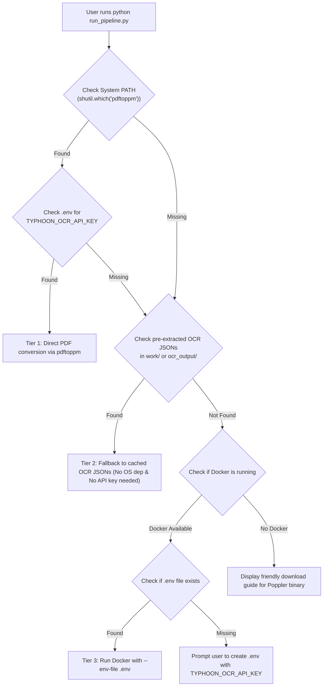
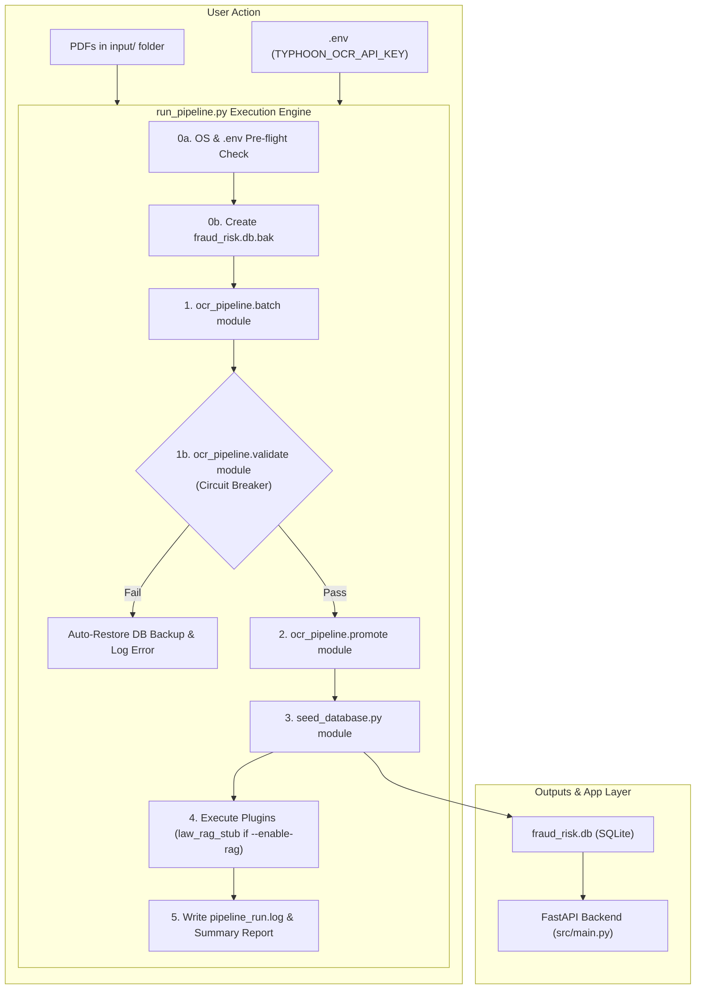

# 1-Day Rapid Prototype Pipeline & Modular RAG Architecture Plan

## Overview
This plan outlines the exact technical implementation for a **1-day prototype pipeline**. It delivers a single-command master runner (`run_pipeline.py`) designed for non-technical demo operators while maintaining 100% backward compatibility with the existing FastAPI app layer (`src/`) and SQLite schema (`fraud_risk.db`). It embeds a clean modular plugin seam (`ocr_pipeline/plugins/`) for optional Law Document RAG ingestion, incorporates data engineering best practices (circuit breaker validation, automated rollback, structured logging), and passes OCR credentials securely via standard `.env` configuration.

---

## User Review Required

> [!IMPORTANT]
> **Key Commitments & Technical Scope**:
> 1. **Zero Schema/API Breaking Changes**: No modifications to existing `fraud_risk.db` table schemas or `src/routers/*` API contracts.
> 2. **Single-Command Non-Technical Execution**: A non-technical user only needs to run `python run_pipeline.py`.
> 3. **Handling OS-Level Dependencies (`poppler-utils`)**: Robust 3-tier fallback strategy so the pipeline runs smoothly on Windows/Mac/Linux even if `poppler` is not natively installed in system PATH.
> 4. **Standard `.env` API Key Passing**: Passes `TYPHOON_OCR_API_KEY` seamlessly to Docker via `--env-file .env` (easiest operator experience with zero hardcoded credentials).
> 5. **Data Quality Circuit Breaker & Auto-Rollback**: Evaluates data quality via `ocr_pipeline.validate` before promoting to database; automatically restores `fraud_risk.db.bak` if pipeline execution fails.
> 6. **Future RAG Plug-in Hook**: Law document RAG features are defined via a modular `BasePipelinePlugin` interface (`ocr_pipeline/plugins/law_rag_stub.py`) callable via `--enable-rag`.

---

## OS Dependency Handling & `.env` API Key Strategy

Because PDF-to-image extraction (for Typhoon OCR) requires `poppler` (`pdftoppm` / `pdf2image`) and an API key (`TYPHOON_OCR_API_KEY`), `run_pipeline.py` implements a **3-Tier Robust Handling Strategy**:



1. **Tier 1 (Direct Execution)**: If `pdftoppm` is detected on system `PATH` and `TYPHOON_OCR_API_KEY` is present in `.env`, proceed with live local PDF conversion.
2. **Tier 2 (Pre-Extracted OCR Fallback)**: If `poppler` or the API key is not present, automatically switch to `--from-ocr` mode using existing cached OCR JSONs (`pipeline/ocr_output/`), enabling 100% offline execution without installing OS binaries.
3. **Tier 3 (Containerized Docker with `.env`)**: If `poppler` is missing on host, automatically launch Docker passing `--env-file .env`:
   ```bash
   docker run --rm --env-file .env -v "$(pwd):/app" fraud-risk-pipeline-v2 python run_pipeline.py
   ```
   *This passes `TYPHOON_OCR_API_KEY` into Docker securely without complex CLI arguments or baking secrets into the Dockerfile.*

---

## Technical Specifications & Pipeline Workflow



---

## Detailed Component Specifications & Data Engineering Enhancements

### 1. Master Pipeline Runner (`run_pipeline.py`)
#### [NEW] [run_pipeline.py](file:///c:/Users/Windows%2010/Desktop/data_modelling/run_pipeline.py)

**Functionality & CLI Interface**:
```bash
python run_pipeline.py [--input-dir INPUT_DIR] [--dry-run] [--enable-rag] [--skip-backup]
```

**Step-by-Step Implementation Logic**:
1. **OS Pre-flight & `.env` Validation**:
   - Load `.env` file if present. Verify `TYPHOON_OCR_API_KEY`.
   - Check if `pdftoppm` is on `PATH`. If missing and raw PDF processing is required:
     - Check if Docker is running $\rightarrow$ auto-invoke Docker with `--env-file .env`.
     - Otherwise, gracefully fall back to Tier 2 cached OCR JSONs in `pipeline/ocr_output/`.
2. **Safety Backup**: Create a timestamped copy `fraud_risk.db` $\rightarrow$ `fraud_risk.db.bak`.
3. **Batch PDF Processing & Error Isolation**:
   - Call `ocr_pipeline.batch.process_batch(input_dir, work_dir)`.
   - Isolate corrupted PDFs or OCR extraction failures so healthy documents continue processing without crashing the pipeline.
4. **Data Quality Circuit Breaker**:
   - Call `ocr_pipeline.validate.validate_batch(...)`.
   - If validation fails critical quality checks, abort pipeline before database mutation and trigger auto-rollback.
5. **Data Promotion**:
   - If `--dry-run` is false, call `ocr_pipeline.promote.promote_batch(seed=False)`.
6. **Database Seeding & Risk Calculation**:
   - If `--dry-run` is false, invoke `seed_database.py` programmatically (`seed_database.main()`) to reload master CSVs and compute risk factor scores.
7. **Plugin Execution**:
   - If `--enable-rag` is passed, invoke `law_rag_stub.run_plugin()`.
8. **Observability & Audit Logging**:
   - Write execution summary (records processed, validation pass rate, elapsed time) to `pipeline_run.log`.
9. **Exception Recovery & Rollback**:
   - Wrap operations in `try...except`. On failure, restore `fraud_risk.db` from `fraud_risk.db.bak` and display diagnostic message.

---

### 2. Modular Plugin Architecture for Law RAG
#### [NEW] [ocr_pipeline/plugins/__init__.py](file:///c:/Users/Windows%2010/Desktop/data_modelling/ocr_pipeline/plugins/__init__.py)
#### [NEW] [ocr_pipeline/plugins/law_rag_stub.py](file:///c:/Users/Windows%2010/Desktop/data_modelling/ocr_pipeline/plugins/law_rag_stub.py)

**Plugin Interface Specification**:
```python
class BasePipelinePlugin:
    def name(self) -> str:
        raise NotImplementedError
    
    def is_enabled(self, args) -> bool:
        raise NotImplementedError
        
    def run(self, db_conn) -> dict:
        raise NotImplementedError
```

---

### 3. Documentation for Demo Operators
#### [MODIFY] [README.md](file:///c:/Users/Windows%2010/Desktop/data_modelling/README.md)
Add a quick "How to Run for Demo & Troubleshooting" section at the top, explaining how to set `TYPHOON_OCR_API_KEY` in `.env` and run `python run_pipeline.py`.

---

## Verification Plan

### Automated Verification
```bash
# 1. Test runner help output & OS/.env pre-flight check
python run_pipeline.py --help

# 2. Test dry-run mode (runs OCR + validation without mutating DB)
python run_pipeline.py --dry-run

# 3. Test master runner execution end-to-end
python run_pipeline.py

# 4. Test API integrity and unit test suite
pytest -q
```
